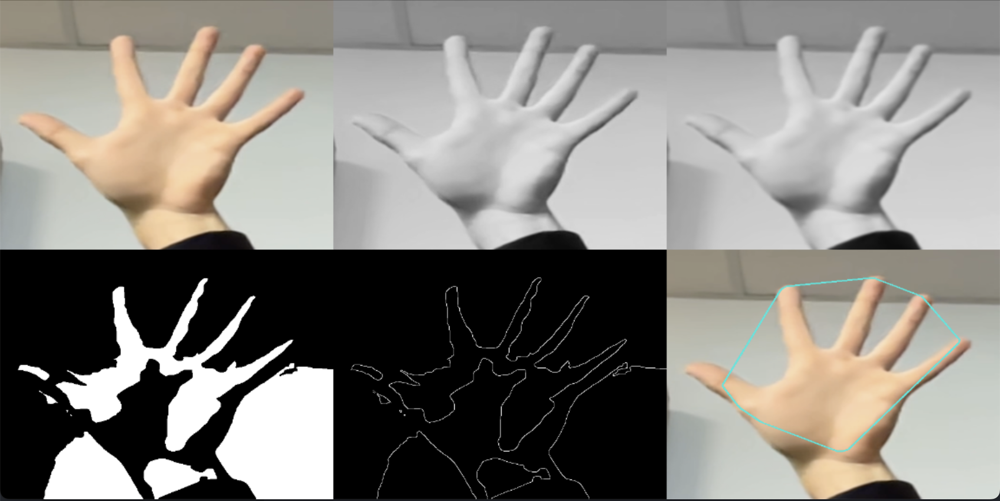

# Initiation à la recherche

## Sujet

Le but de ce projet est d’implémenter un système de reconnaissance des mouvements de la main à l’aide d’un classificateur classique Haar-cascade.

Le système doit reconnaître le geste de la main de l’utilisateur (poing, un doigt, deux, trois, quatre,...) et le mapper à différentes tâches telles que le lancement d’applications comme le bloc-notes, la peinture, et l’ouverture de sites web.

Le système doit être mis en œuvre avec l’aide de la librairie de "Computer Vision" - OpenCV, comme dans l’article [Static Hand Gesture and Face Recognition System](https://ijcrt.org/papers/IJCRT2109339.pdf).
Une extension possible serait l’implémentation d’un système de détection des mouvements de la tête ou du corps, tout entier.

## Installation

Pour installer le projet, il suffit de cloner le dépôt GitHub et d’installer les dépendances au moyen de pip et d'un environnement virtuel.

```bash
git clone https://github.com/clairekth/initiation_recherche
cd initiation_recherche
python -m venv venv
source venv/bin/activate
pip install -r requirements.txt
```

## Avancement en date du 2024-03-19

-   Script de prétraitement des images pour la détection des formes de la main.
-   Préparation mini exposé sur Haar-cascade.

